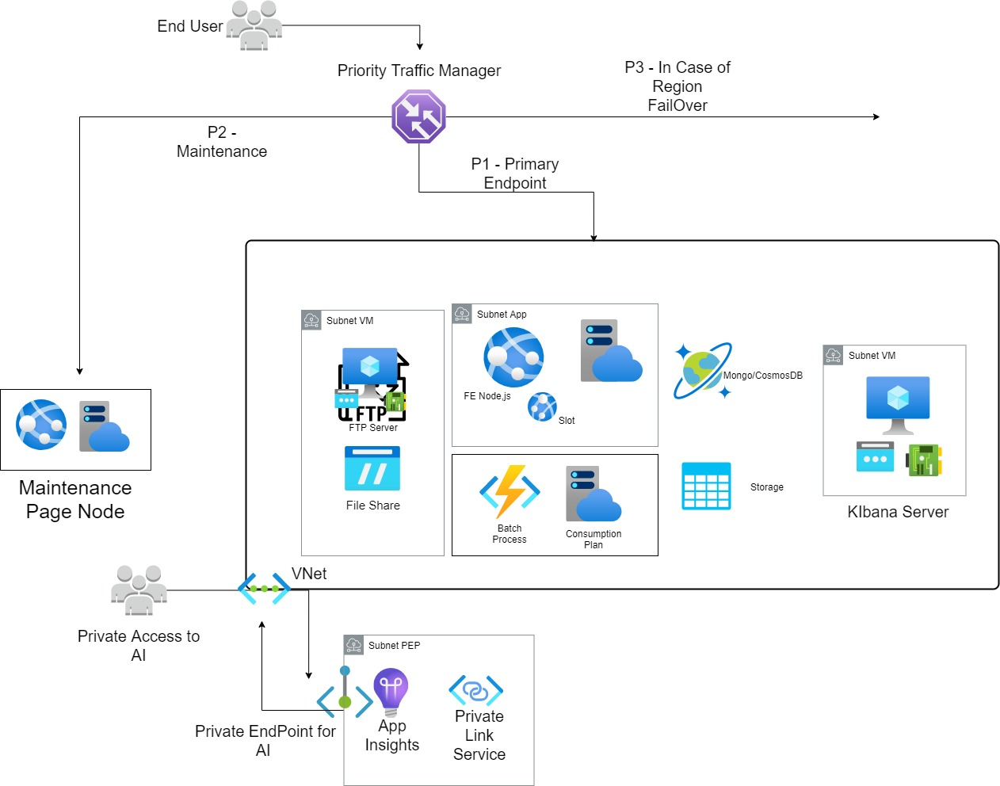

# Assessment Sentia
This following assessment has been hosted on Microsoft Azure Cloud. Current repository contains Infrastructure as Code(IaC) which host complete infra as per mentioned requirments.
Implementation is completey done on Azure Devops Including repository and also for CI anb CD. 

## Table of content
- [Prerequisites](#Prerequisites)
- [Implementation](#Implementation)

## Prerequisites
1) Install Biceps and Azure CLI
      * Following link helps in set up [Azure Bicep and Azure CLI](https://docs.microsoft.com/en-us/azure/azure-resource-manager/bicep/install)
2) Azure Subscription
3) Azure Devops Organization,  DevOps Project
4) Private Build Agent(not mandatory, but good to have)
      * For complete setup I used private agent Pool for all CI and CD.
      * Create Windows VM and configure Agent to run as service to have your private agent. 
      * Ensure you have all Prerequisites installed on agent machine. 
      * Specific to this solution, Powershell Version 5.* and above, Bicep and Azure CLI
5) Create a Service Principle to establish connection between Azure and DevOps.

## Over view of infra Arctecture.

## Implemented Azure Services.
  * App Plan & App Service - for Front End(FE)
  * Consumption Plan & Function App - For batch process
  * CosmosDB - Replace MongoDB
  * Azure Virtual Machine(linux) - to serview as FTP server and Kibana
  * Storage Account - Utilize File share to mount to FTP
  * Traffic Manager - Traffic route 
  * Application Insight - ((assumptions) to replace Kiaban)
  * Private Endpoint(provide private accesss(assumptions))

## Implementation.

Azure Bicep is the new way of IaC to Provision infrastructure in Azure. Yet still there are different way of implementations. In Biceps it is possible to declare all resources in singel file, also we can have nested templates to avoid long pages of code.
In this solution i have declared  resources form **main.bicep**, where as all the resources and parameter are declare. Following with that, I have separated Azure services into each folder. Each environment has specific parameter file. 

Now, **main.bicep** templated act as singel source of template, nesting all other templates. bicep utilizes **modules** to refer to other bicep templates as in below image.
<a src="main.bicep">

 * Front End is being hosted on **Azure App service of Linux** to run application on **Node.js application behind NGINX**
 * **MongoDB** can be replaced with **CosmosDB** cluster for storing data
 * **FTP Services** can be hosted on a **Azure Linux VM**,for better scalability and **Azure File Share** will be mounted such to isolate documents and secure.
 * **jobs** which executes few times in a day can be moved to **Azure Functions** where bash and python scritps can be supported.
 * **Log and Dashboards** can be viewed from Kibana, **Azure Linux VM** host Elastic Search, kibana etc, which can help in visualize Data. 
 * Kibana Azure VM will be created on desired network and subnet, where it cannot be accessed publically
     # Assumption
     ELS and Kiaban can be replaces with Azure Application insights. In order to create provide private access, Azure provides multiple ways of restricting access. 
     1) RBAC - on who can access
     2) Private Endpoint - to access only for specified network(as privateLinkScope is in preview, this feature can be tested before implementing)
     
  in this solution, I have created application insights that has been scoped to privateLink, where private endpoint is created
     
     

