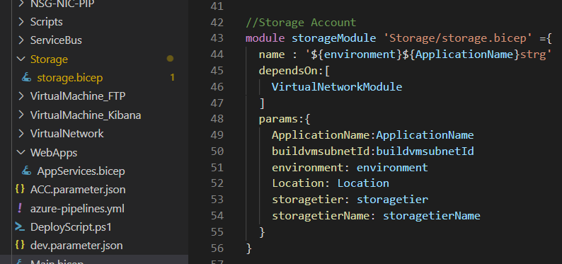

# Assessment Sentia
This following assessment has been hosted on Microsoft Azure Cloud. Current repository contains Infrastructure as Code(IaC) which host complete infra as per mentioned requirments.
Implementation is completey done on Azure Devops for repository, CI and CD, Private agent pool etc.. 

## Table of content
- [Prerequisites](#Prerequisites)
- [Implementation](#Implementation)
- [Architecture](#Architecture)
- [Implemented Azure Services](#Implemented_Azure_Services)
- [Implementation](#Implementation)
- [Assumption](#Assumption)
- [DevOps PipeLine](#DevOps_PipeLine)

## Prerequisites
1) Install Biceps and Azure CLI
      * Following link helps in set up [Azure Bicep and Azure CLI](https://docs.microsoft.com/en-us/azure/azure-resource-manager/bicep/install)
2) Azure Subscription
3) Azure Devops Organization,  DevOps Project
4) Private Build Agent(not mandatory, but good to have)
      * Ensure you have all Prerequisites installed on agent machine. 
      * Specific to this solution, Powershell Version 5.* and above, Bicep and Azure CLI
5) Create a Service Principle and establish connection between Azure and DevOps.
6) Before starting Create Storage account and Keyvault manully. This is to have common script and Credentials used in the Bicep Templates.

## Architecture.

**Note:** as per design Azure AD App Registration credentials are is required to mount storage account inside azure VM. For the reason as pre checklist. App ClientID, ClientKey, TenantID, VMAdminPassword need to manually added on the KV.

## Implemented Azure Services.
  * App Plan & App Service - for Front End(FE)
  * Consumption Plan & Function App - For batch process
  * CosmosDB - Replace MongoDB
  * Azure Virtual Machine(linux) - to serview as FTP server and Kibana
  * Storage Account - Utilize File share to mount to FTP
  * Traffic Manager - Traffic route 
  * Application Insight - ((assumptions) to replace Kiaban)
  * Private Endpoint(provide private accesss(assumptions))

## Implementation.

Azure Bicep is the new way of IaC to Provision infrastructure in Azure. Yet still there are different way of implementations. In Biceps it is possible to declare all resources in singel file, also we can have nested templates to avoid long pages of code.
In this solution i have declared  resources form **main.bicep**, where as all the resources and parameter are declare. Following with that, I have separated Azure services into each folder. Each environment has specific parameter file. 

Now, **main.bicep** templated act as singel source of template, nesting all other templates. bicep utilizes **modules** to refer to other bicep templates as in below image.

Bicep takes use of Az CLI to start the deployment. There is no specif task as in for ARM in Azure DevOps. So I have create **DeployScript.ps1** for the same. it takes the arguments of template file and parameter file.

Each stage has it's own configuration and fucntionalities. Few condition inside bicep templates manage provision additional resources. 

 * Front End is being hosted on **Azure App service of Linux** to run application on **Node.js application behind NGINX**
 * **MongoDB** can be replaced with **CosmosDB** cluster for storing data
 * **FTP Services** can be hosted on a **Azure Linux VM**,for better scalability and **Azure File Share** will be mounted such to isolate documents and secure.
 * **jobs** which executes few times in a day can be moved to **Azure Functions** where bash and python scritps can be supported.
 * **Log and Dashboards** can be viewed from Kibana, **Azure Linux VM** host Elastic Search, kibana etc, which can help in visualize Data. 
 * Kibana Azure VM will be created on desired network and subnet, where it cannot be accessed publically
 
 # Assumption
 ELS and Kiaban can be replaces with Azure Application insights. In order to create provide private access, Azure provides multiple ways of restricting access. 
 1) RBAC - on who can access
 2) Private Endpoint - to access only for specified network(as privateLinkScope is in preview, this feature can be tested before implementing)
     
 In this solution, I have created application insights that has been scoped to privateLink, where private endpoint is created

 # DevOps PipeLine
 This process has been completely automated using Azure DevOps. Code developed locally has been moved to DevOps Git Repo. 
 CI and CD pipeline has been developed in **YAML** format. There are no much dependencies on the variables except private agents.
 
 **Note:** private agent pool won't be shown in the YAML, so line "pool: GlobeTrotterLife-AGPool" has to be modified before your use.

 As per the requirment multiple environments are requsetd, In the Yaml file there are multiple stage created Name **Dev, Acceptance and Production**. Each environment uses it's   own specific parameter file which is in format **<environment>.parameter.json**.

YAML Supports Environments. All stages on the Yaml has been configured with Environments, this is to ensure **Approvals and Mutliple additional things**. 
it has been designed in way that all Stages are depended to each other.
     
**create Infra** pipeline consist of 4 Stages, 
1) **Build** : Checkout code from repository and create Artificate, Which can be used in further stages.
   - This has two task.
     *  Copy Task : Copy all files from repository to Specific folder.
     *  Publish Artifact : Create and Publish folder.
2) **Dev** : Creation of infrastructure starts from here. 
     - It has 2 Jobs and 3 task. one is for Environment pre checks and another job has task to do. 
          *  Download Task : download artifact file to Specific folder.
          *  UploadVMExtensionContent : There are few script that has been uploaded to **common storage Account**(Create of Common storage account and Common KeyValut is not mentioned in the pipeline, as this is pre work before starting infra.)
          *  Create Infrastructure : This step utilize **DeployScript.ps1** trigger deployment on the resource Group. This will create a New resourcegroup is it dosen't exist.
3) **Acceptance** : Similar steps has been carried out. Additionally environment permission has been added, such as Approval(this has been done on my end so won't be shown on you end.
4) **Production** : Similar steps has been carried out. Additionally environment permission has been added, such as Approval(this has been done on my end so won't be shown on you end.     
     
**Note:** templates are designed in way that Web App slot and auto scalling will only be done in Acceptance and Production.
     
     
